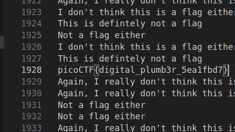
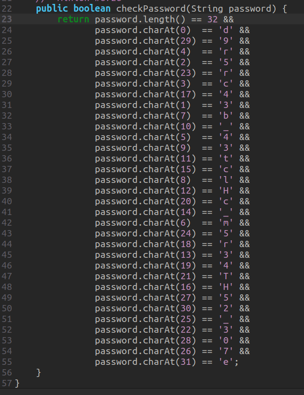

# Miscellaneous

## [plumbing](https://play.picoctf.org/practice/challenge/48)
### Description
Sometimes you need to handle process data outside of a file. Can you find a way to keep the output from this program and search for the flag? Connect to `jupiter.challenges.picoctf.org 4427`.

### Solution
Looked up how to store data to a file [here](https://www.geeksforgeeks.org/how-to-send-a-file-using-netcat-and-then-keep-the-connection-alive/) then i did code . and ctrl f picoCTF (could have done grep also)



### Terminal
```shell
nc jupiter.challenges.picoctf.org 4427 > output.txt
```

### Flag
>picoCTF{digital_plumb3r_5ea1fbd7}

## [Glitch Cat](https://play.picoctf.org/practice/challenge/242)

### Description
Our flag printing service has started glitching!

Additional details will be available after launching your challenge instance.

### Solution
```sh
print('picoCTF{gl17ch_m3_n07_' + chr(0x61) + chr(0x34) + chr(0x33) + chr(0x39) + chr(0x32) + chr(0x64) + chr(0x32) + chr(0x65) + '}')
```

### Flag
>picoCTF{gl17ch_m3_n07_a4392d2e}


# Reverse Engineering

## [vault-door-training](https://play.picoctf.org/practice/challenge/7?page=1&search=vault)
### Description
Your mission is to enter Dr. Evil's laboratory and retrieve the blueprints for his Doomsday Project. The laboratory is protected by a series of locked vault doors. Each door is controlled by a computer and requires a password to open. Unfortunately, our undercover agents have not been able to obtain the secret passwords for the vault doors, but one of our junior agents obtained the source code for each vault's computer! You will need to read the source code for each level to figure out what the password is for that vault door. As a warmup, we have created a replica vault in our training facility. The source code for the training vault is here: [VaultDoorTraining.java](https://jupiter.challenges.picoctf.org/static/03c960ddcc761e6f7d1722d8e6212db3/VaultDoorTraining.java)

### Solution
literally just opened the file in a text editor

```sh
    public boolean checkPassword(String password) {
        return password.equals("w4rm1ng_Up_w1tH_jAv4_3808d338b46");
    }
}
```

### Flag
>picoCTF{w4rm1ng_Up_w1tH_jAv4_3808d338b46}


## [vault-door-1](https://play.picoctf.org/practice?page=1&search=vault)
### Description
This vault uses some complicated arrays! I hope you can make sense of it, special agent. The source code for this vault is here: [VaultDoor1.java](https://jupiter.challenges.picoctf.org/static/ff2585f7afd21b81f69d2fbe37c081ae/VaultDoor1.java)

### Solution
tried a lot to find a way to automate the solution but couldnt so i just did it manually 



### Flag
>picoCTF{d35cr4mbl3_tH3_cH4r4cT3r5_75092e}

## [vault-door-3](https://play.picoctf.org/practice/challenge/60?page=1&search=vault)
### Description
This vault uses for-loops and byte arrays. The source code for this vault is here: [VaultDoor3.java](https://jupiter.challenges.picoctf.org/static/a648ca6dd275b9454c5d0de6d0f6efd3/VaultDoor3.java)

### Solution
wrote a python script to solve it
```python
a="jU5t_a_sna_3lpm18gb41_u_4_mfr340"
ans=[0,0,0,0,0,0,0,0,0,0,0,0,0,0,0,0,0,0,0,0,0,0,0,0,0,0,0,0,0,0,0,0,]
s=''
for i in range(0,8):
	ans[i]=a[i]
for i in range(8,16):
	ans[i]=a[23-i]
for i in range(16,32,2):
	ans[i]=a[46-i]
for i in range(31,16,-2):
	ans[i]=a[i]
for i in range(0,32):
	s+=str(ans[i])
print(s)
```

### Flag
>picoCTF{jU5t_a_s1mpl3_an4gr4m_4_u_1fb380}


## [vault-door-4](https://play.picoctf.org/practice/challenge/71?page=1&search=vault)
### Description
This vault uses ASCII encoding for the password. The source code for this vault is here: [VaultDoor4.java](https://jupiter.challenges.picoctf.org/static/834acd392e0964a41f05790655a994b9/VaultDoor4.java)

### Solution
just converted all of them to get the flag
```python
myBytes = [ 106 , 85 , 53 , 116 , 95 , 52 , 95 , 98 ,

0x55, 0x6e, 0x43, 0x68, 0x5f, 0x30, 0x66, 0x5f,

0142, 0131, 0164, 063 , 0163, 0137, 0146, 064 ,

'a' , '8' , 'c' , 'd' , '8' , 'f' , '7' , 'e' ]
```

### Flag
>picoCTF{jU5t_4_bUnCh_0f_bYt3s_F4a8cd8f7e}

## [vault-door-5](https://play.picoctf.org/practice/challenge/77?page=1&search=vault)
### Description
In the last challenge, you mastered octal (base 8), decimal (base 10), and hexadecimal (base 16) numbers, but this vault door uses a different change of base as well as URL encoding! The source code for this vault is here: [VaultDoor5.java](https://jupiter.challenges.picoctf.org/static/d31ce4356bdfd15d33a9af7e35ab4d0a/VaultDoor5.java)

### Solution
converted from base64 then ascii code
```python
JTYzJTMwJTZlJTc2JTMzJTcyJTc0JTMxJTZlJTY3JTVmJTY2JTcyJTMwJTZkJTVmJTYyJTYxJTM1JTY1JTVmJTM2JTM0JTVmJTY1JTMzJTMxJTM1JTMyJTYyJTY2JTM0
```

### Flag
>picoCTF{c0nv3rt1ng_fr0m_ba5e_64_e3152bf4}

## [vault-door-6](https://play.picoctf.org/practice/challenge/45?page=1&search=vault)
### Description
This vault uses an XOR encryption scheme. The source code for this vault is here: [VaultDoor6.java](https://jupiter.challenges.picoctf.org/static/937a166e2c8c5bf34928a2dab22e8ade/VaultDoor6.java)

### Solution
XOR'ed the input then decode the bytes into ascii
```python
import codecs
L=[]
myBytes =[

0x3b, 0x65, 0x21, 0xa , 0x38, 0x0 , 0x36, 0x1d,

0xa , 0x3d, 0x61, 0x27, 0x11, 0x66, 0x27, 0xa ,

0x21, 0x1d, 0x61, 0x3b, 0xa , 0x2d, 0x65, 0x27,

0xa , 0x6c, 0x61, 0x6d, 0x37, 0x6d, 0x6d, 0x6d]

for i in myBytes:
	L.append(i^0x55)
print(L)

a=bytes([110, 48, 116, 95, 109, 85, 99, 72, 95, 104, 52, 114, 68, 51, 114, 95, 116, 72, 52, 110, 95, 120, 48, 114, 95, 57, 52, 56, 98, 56, 56, 56])
ans=codecs.decode(a,'Ascii')
print(ans)
```

### Flag
>picoCTF{n0t_mUcH_h4rD3r_tH4n_x0r_948b888}

# Cryptography

## [Mod 26](https://play.picoctf.org/practice/challenge/144)

### Description
Cryptography can be easy, do you know what ROT13 is? `cvpbPGS{arkg_gvzr_V'yy_gel_2_ebhaqf_bs_ebg13_nSkgmDJE}`

### Solution
decoded rot13
```sh
import codecs

a="cvpbPGS{arkg_gvzr_V'yy_gel_2_ebhaqf_bs_ebg13_nSkgmDJE}"

rot13=codecs.decode(a,'rot_13')

print(rot13)
```

### Flag
>picoCTF{next_time_I'll_try_2_rounds_of_rot13_aFxtzQWR}


# Forensics

## [information](https://play.picoctf.org/practice/challenge/186)
### Description

Files can always be changed in a secret way. Can you find the flag? [cat.jpg](https://mercury.picoctf.net/static/a614a27d4cb251d04c7d2f3f3f76a965/cat.jpg)

### Solution
this was base64 encoded
```sh
 <rdf:Description rdf:about=''
  xmlns:cc='http://creativecommons.org/ns#'>
  <cc:license rdf:resource='cGljb0NURnt0aGVfbTN0YWRhdGFfMXNfbW9kaWZpZWR9'/>
 </rdf:Description>
```

### Flag
>picoCTF{the_m3tadata_1s_modified}

